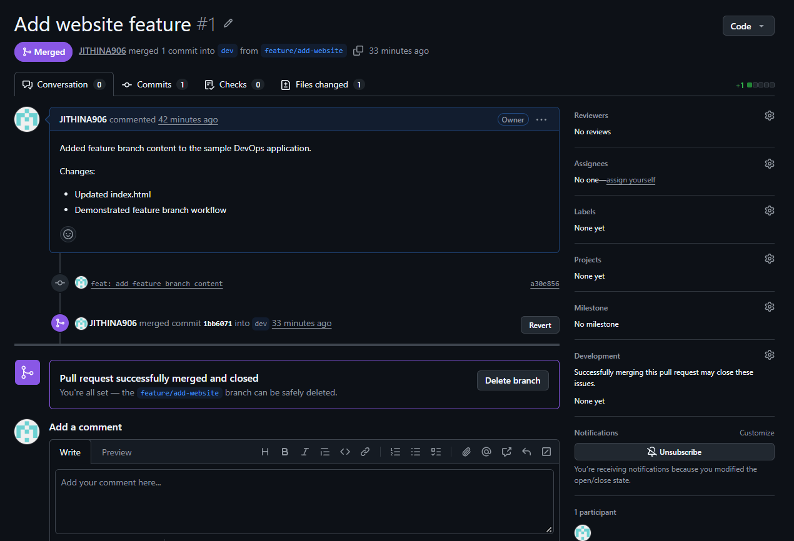
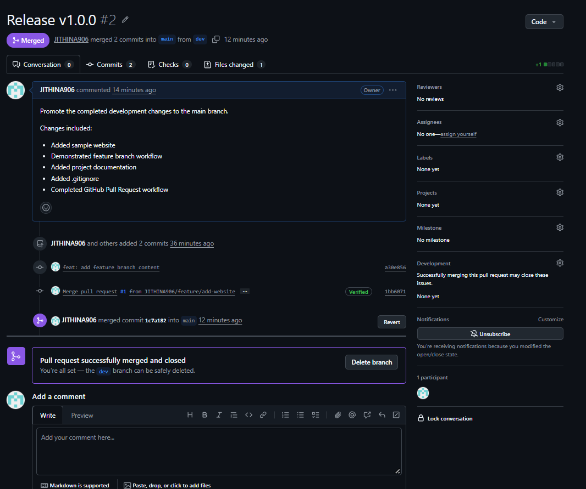

# DevOps Git Workflow Project

A version-controlled DevOps project demonstrating Git and GitHub best practices, including branching, feature development, Pull Requests, merging, `.gitignore`, Git tags, versioning, and Markdown documentation.

## Objective

The objective of this project is to demonstrate how Git and GitHub can be used to manage a DevOps project using a structured version-control workflow.

This project demonstrates:

- Git repository initialization
- GitHub repository management
- Branching strategy
- Feature branch development
- Meaningful Git commits
- Pull Requests
- Branch merging
- `.gitignore`
- Git tags and versioning
- Markdown documentation

## Tools Used

- Git
- GitHub
- PowerShell
- Visual Studio Code
- Markdown
- HTML
- Bash

## Project Structure

```text
devops-git-project/
│
├── app/
│   └── index.html
│
├── scripts/
│   └── deploy.sh
│
├── docs/
│   └── workflow.md
│
├── screenshots/
│   ├── feature-to-dev-pr.png
│   ├── dev-to-main-pr.png
│   └── git-commands.png
│
├── .gitignore
└── README.md
```

## Branching Strategy

The project follows a simple three-level branching strategy:

```text
main
 │
 └── dev
      │
      └── feature/add-website
```

| Branch | Purpose |
|---|---|
| `main` | Production-ready code |
| `dev` | Development and integration |
| `feature/*` | Individual feature development |

Feature development is performed in a separate branch instead of directly modifying `main`.

## Git Workflow

```text
Create Repository
       ↓
      main
       ↓
      dev
       ↓
Feature Branch
       ↓
Develop Feature
       ↓
Commit Changes
       ↓
Pull Request
       ↓
feature → dev
       ↓
Pull Request
       ↓
dev → main
       ↓
Create Git Tag
       ↓
   v1.0.0
```

This workflow keeps the `main` branch stable while allowing features to be developed and reviewed separately.

## 1. Initialize the Git Repository

The project was initialized as a Git repository:

```bash
git init
```

The main branch was configured:

```bash
git branch -M main
```

Repository status was checked using:

```bash
git status
```

## 2. Create the Initial Commit

Project files were staged:

```bash
git add .
```

The initial commit was created:

```bash
git commit -m "chore: initialize DevOps Git project"
```

The commit history can be viewed with:

```bash
git log --oneline
```

Meaningful commit messages were used to maintain a clear project history.

## 3. Connect the Repository to GitHub

The local repository was connected to GitHub:

```bash
git remote add origin <GitHub-repository-URL>
```

The remote was verified:

```bash
git remote -v
```

The main branch was pushed to GitHub:

```bash
git push -u origin main
```

## 4. Create the Development Branch

A development branch was created from `main`:

```bash
git switch -c dev
```

The branch was pushed to GitHub:

```bash
git push -u origin dev
```

The `dev` branch is used to integrate completed features before they are promoted to `main`.

## 5. Create the Feature Branch

A feature branch was created from `dev`:

```bash
git switch -c feature/add-website
```

After making changes to the application:

```bash
git status
git add .
git commit -m "feat: add feature branch content"
```

The feature branch was pushed to GitHub:

```bash
git push -u origin feature/add-website
```

## 6. Pull Request: Feature → Dev

After completing the feature, a Pull Request was created on GitHub:

```text
feature/add-website → dev
```

The Pull Request was used to review the changes before merging them into the development branch.

The Pull Request included:

- Updated `index.html`
- Feature branch development
- Changes ready for integration

After review, the Pull Request was merged into `dev`.

### Pull Request Evidence



## 7. Update the Local Dev Branch

After merging the feature Pull Request, the local development branch was updated:

```bash
git switch dev
git pull origin dev
```

This ensures the local `dev` branch contains the latest changes from GitHub.

## 8. Pull Request: Dev → Main

After integrating the feature into `dev`, a second Pull Request was created:

```text
dev → main
```

This Pull Request was used to promote the completed development changes into the production-ready `main` branch.

After review, the Pull Request was merged.

### Pull Request Evidence



## 9. Git Tags and Versioning

Git tags are used to mark important points in the project's history, commonly for software releases.

For this project, the first stable version was marked as:

```text
v1.0.0
```

The latest `main` branch was first updated:

```bash
git switch main
git pull origin main
```

The release tag was created:

```bash
git tag -a v1.0.0 -m "First stable release"
```

Available tags can be viewed using:

```bash
git tag
```

The tag was pushed to GitHub:

```bash
git push origin v1.0.0
```

### Tagging Workflow

```text
dev
 ↓
Pull Request
 ↓
main
 ↓
Stable Release
 ↓
v1.0.0
```

Tags make it easier to identify and restore specific versions of the project.

## 10. `.gitignore`

The `.gitignore` file prevents unwanted, temporary, or sensitive files from being tracked by Git.

Example:

```gitignore
# Environment files
.env
.env.*

# Logs
*.log

# Temporary files
*.tmp
*.temp

# IDE files
.vscode/
.idea/

# Secrets
*.pem
*.key

# Operating system files
.DS_Store
Thumbs.db
```

The `.gitignore` file helps prevent secrets, temporary files, IDE configuration files, and other unnecessary files from being committed.

## 11. Git Commands Used

### Repository

```bash
git init
git status
git clone
```

### Branching

```bash
git branch
git branch -M main
git switch -c dev
git switch -c feature/add-website
git switch dev
git switch main
```

### Staging and Commits

```bash
git add .
git commit -m "commit message"
git log --oneline
```

### Remote Repository

```bash
git remote -v
git remote add origin <repository-url>
git push -u origin main
git push -u origin dev
git push -u origin feature/add-website
git pull origin dev
git pull origin main
```

### Tags

```bash
git tag
git tag -a v1.0.0 -m "First stable release"
git push origin v1.0.0
```

## 12. Pull Request Workflow

### Feature Development

```text
feature/add-website
        ↓
    Pull Request
        ↓
       dev
```

### Production Release

```text
dev
 ↓
Pull Request
 ↓
main
```

Pull Requests provide an opportunity to review changes before they are merged into the target branch.

## 13. Git Best Practices Followed

- Created separate branches for development and features.
- Avoided making feature changes directly on `main`.
- Used meaningful commit messages.
- Used Pull Requests for merging.
- Used `.gitignore` to prevent unwanted files from being committed.
- Used Git tags for release versioning.
- Maintained project documentation using Markdown.
- Kept `main` as the production-ready branch.
- Used `dev` as the integration branch.
- Used feature branches for individual changes.

## 14. Project Completion

The project successfully demonstrates:

- [x] Git repository initialization
- [x] GitHub repository creation
- [x] `main` branch
- [x] `dev` branch
- [x] Feature branch
- [x] Meaningful commits
- [x] Feature → Dev Pull Request
- [x] Dev → Main Pull Request
- [x] `.gitignore`
- [x] Git tags
- [x] `v1.0.0` release
- [x] Markdown documentation

## Conclusion

This project demonstrates a practical Git and GitHub workflow for DevOps development.

The project uses feature branches for development, Pull Requests for code integration, a development branch for testing and integration, and the `main` branch for stable production-ready code.

Git tags are used to identify stable releases, with `v1.0.0` representing the first stable version of the project.

This workflow improves collaboration, code review, version tracking, and release management.